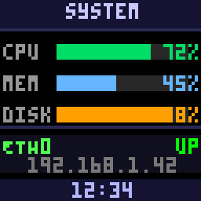
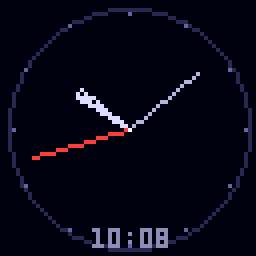
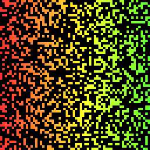
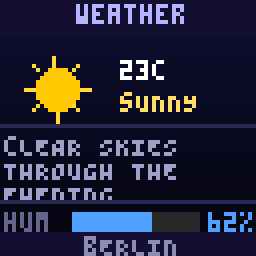
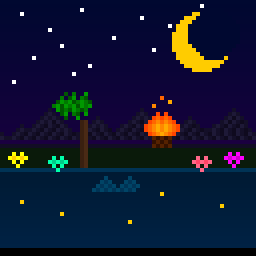

# pixoo-mcp

Python library and MCP server for [Divoom Pixoo](https://divoom.com/products/pixoo-64) LED displays (16x16, 32x32, 64x64).

Draw pixels, shapes, text, and images on the display over Wi-Fi. Includes an
[MCP](https://modelcontextprotocol.io/) server so AI agents can use the display
as an output device.

## Quick start

```python
from pixoo import Pixoo

p = Pixoo("10.0.0.42")       # size=64 by default
p.clear(0, 0, 40)
p.draw_text("Hello!", 2, 2, 255, 255, 255)
p.draw_bar(2, 12, 60, 5, 0.75, 0, 255, 0)
p.push()
```

## Installation

```bash
pip install .                  # library only (requires requests)
pip install ".[images]"        # + Pillow for image loading
pip install ".[server]"        # + MCP server dependencies
```

Or without pyproject.toml:

```bash
pip install -r requirements.txt              # library + images
pip install -r requirements-server.txt       # + MCP server
```

## CLI

```bash
python -m pixoo 10.0.0.42 smiley
python -m pixoo plasma              # auto-discovers device
python -m pixoo image photo.png
python -m pixoo text "Hello!"
python -m pixoo discover
```

If no IP is given, the module checks `PIXOO_IP` env var, then tries
auto-discovery via the Divoom cloud.

## Library API

### Constructor

```python
Pixoo(ip, port=80, *, size=64, refresh_connection=True, debug=False, gamma=True)
```

`size` must be 16, 32, or 64 matching your hardware model.

`gamma` controls per-channel LED gamma correction. The Pixoo's blue LEDs
are much brighter than red/green at the same drive value, so colours like
purple appear as pure blue without correction. With `gamma=True` (the
default) a calibrated LUT boosts R and G before sending to the device,
while `to_png()` still returns sRGB-correct colours. Pass `False` to
disable, or a `(R, G, B)` tuple of per-channel exponents for custom
calibration.

### Drawing

| Method | Description |
|--------|-------------|
| `clear(r, g, b)` | Fill buffer with a solid colour |
| `set_pixel(x, y, r, g, b)` | Set a single pixel |
| `draw_line(x0, y0, x1, y1, r, g, b)` | Line between two points |
| `draw_rect(x, y, w, h, r, g, b, filled=False)` | Rectangle (outline or filled) |
| `draw_circle(cx, cy, radius, r, g, b, filled=False)` | Circle (outline or filled) |
| `draw_gradient(x, y, w, h, r0, g0, b0, r1, g1, b1, direction=)` | Linear gradient fill. Blends from (r0,g0,b0) to (r1,g1,b1). `direction`: `"vertical"` (top→bottom, default) or `"horizontal"` (left→right) |
| `draw_bar(x, y, w, h, value, r, g, b, ...)` | Progress bar. `value` 0.0–1.0, unfilled portion uses `bg_r/bg_g/bg_b` (default 40) |
| `draw_text(text, x, y, r, g, b, align=, max_width=)` | Bitmap text (PICO-8 font, see below) |
| `draw_image(source, xy=(0,0))` | Load image (path, file, or PIL Image); auto-resizes to fit |
| `draw_bitmap(x, y, palette, data, scale=1)` | Inline pixel-art sprite: `palette` is a list of `(r,g,b)` tuples (or `None` for transparent), `data` is a list of strings where each char is a base-36 palette index. |
| `push()` | Send buffer to the display (auto-cancels any running animation) |
| `push_animation(frames, speed_ms=100)` | Send a list of `snapshot()` buffers as a looping on-device animation (~60 frame limit on 64x64) |
| `snapshot()` | Copy the current buffer (for building animation frame lists) |
| `to_png(scale=4)` / `save_png(path)` | Encode the current buffer as PNG (nearest-neighbour upscaled so pixels stay crisp) |
| `to_gif(frames, speed_ms=200, scale=4)` / `save_gif(path, frames, ...)` | Encode a list of `snapshot()` buffers as an animated GIF |
| `to_ascii()` | 10-level grayscale ASCII preview of the current buffer |

### Text features

- PICO-8 bitmap font: 3x5 pixel glyphs, 4px character width
- `align`: `"left"` (default), `"center"`, `"right"`
- `max_width`: word-wrap to fit within N pixels
- Supports `\n` for explicit line breaks

### Device control

`set_brightness`, `screen_on`, `screen_off`, `buzzer`, `set_channel`,
`send_text` (device-side scrolling text), `get_config`, `reboot`, and more.

## Examples

The `examples/` directory has standalone demos that showcase the library:

| Script | Preview | What it shows |
|--------|---------|---------------|
| `dashboard.py` |  | System-monitor panel with text, progress bars, dividers |
| `clock.py` |  | Analog clock with trig-drawn hands, live-updating |
| `game_of_life.py` |  | Conway's Game of Life as a looping animation |
| `weather_card.py` |  | Rich weather card with icon, word-wrapped forecast, humidity bar |
| `pixel_art.py` |  | Nighttime scene with bitmap sprites, gradients, `parse_color`, `save_png` |
See also [ASCII previews](examples/ascii_previews.txt) of all examples.

Run any example:

```bash
python examples/dashboard.py 10.0.0.42
PIXOO_IP=10.0.0.42 python examples/clock.py
```

## MCP server

Run as an MCP server for AI agents:

```bash
# stdio (for local IDE integration)
python -m pixoo.server --ip 10.0.0.42

# HTTP (for remote/Docker)
python -m pixoo.server --http --port 9100
PIXOO_IP=10.0.0.42 python -m pixoo.server --http
```

The server auto-detects the display resolution from the device at startup
and bakes it into the MCP instructions, so AI agents can draw immediately
without a separate info call. To skip auto-detection (e.g. device is
offline during server start), pass `--size` or set `PIXOO_SIZE`:

```bash
python -m pixoo.server --ip 10.0.0.42 --size 64
PIXOO_SIZE=32 python -m pixoo.server --http
```

### Docker

```bash
# from the repo root; uses PIXOO_IP from your shell/.env
docker compose up -d --build
```

Manual equivalent:

```bash
docker build -t pixoo-mcp .
docker rm -f pixoo-mcp 2>/dev/null || true
docker run -d --name pixoo-mcp --network host -e PIXOO_IP pixoo-mcp
# Optional: PIXOO_SIZE=32 for non-64 models
```

### Cursor IDE

Add to `~/.cursor/mcp.json` for global access:

```json
{
  "mcpServers": {
    "pixoo": {
      "url": "http://localhost:9100/mcp"
    }
  }
}
```

### MCP tools

| Tool | Description |
|------|-------------|
| `draw(commands, push=True, preview=False)` | Batch draw operations: clear, pixel, line, rect, circle, text, bar, gradient, bitmap. Colours accept hex (`"#ff8800"`, `"#f80"`), CSS names (`"red"`, `"orange"`), or RGB lists (`[255, 136, 0]`). |
| `show_image(url)` | Fetch and display an image from a URL |
| `show_text(text, ...)` | Device-side scrolling/static text overlay |
| `device_control(action, value=...)` | Device-level actions: `info`, `brightness`, `on`/`off`, `buzzer`, `clear_text`, `channel` (`"custom"`, `"faces"`, `"cloud"`, `"visualizer"`, or 0–3), `startup_channel`, `clock <id>`, `play_gif_url <url>`, `reboot` |

#### Previewing draws (headless / no-device iteration)

`draw` takes two extra flags so an agent can see what it rendered:

- `push=False` skips the HTTP push to the device, letting you iterate on a
  layout without touching hardware.
- `preview=True` returns the rendered buffer as an ASCII grayscale grid
  **plus** an inline PNG image content block. Any image-capable MCP client
  (Cursor, Claude Desktop, Claude Code) will show the PNG directly to the
  model; other clients fall back to the ASCII preview.

```python
draw(
    commands=[
        {"op":"clear","color":"#000028"},
        {"op":"circle","cx":32,"cy":32,"radius":20,"color":"#ffdc00","filled":True},
    ],
    push=False,
    preview=True,
)
```

The most recent preview is also exposed as:

- MCP resource `pixoo://last-frame.png`
- HTTP endpoint `GET /api/preview.png` (when running `--http`) — handy for
  opening in a browser while debugging a remote/headless server.

## Known hardware quirks

See [`pixoo/PROTOCOL.md`](pixoo/PROTOCOL.md) for the full protocol reference.

- **Animation frame limit (~60 on 64x64)**: the device has a fixed memory
  budget for animation frames.  Excess frames are accepted over HTTP but
  silently dropped from playback.  `push_animation()` warns when you exceed
  the limit.
- **Sticky animations**: once a multi-frame animation is playing, a simple
  `Draw/SendHttpGif` with `PicNum=1` does not interrupt it.  `push()`
  works around this automatically using a brightness-masked channel switch
  (brief ~300 ms black-out, no visible flash).
- **PicID counter overflow**: the device stops responding after ~300
  `SendHttpGif` calls.  The library auto-resets the counter every 32 pushes.
- **Phone app conflict**: the Divoom app can switch the channel at any time,
  overriding your content.  Use `set_startup_channel(3)` or close the app.

## License

MIT. See [LICENSE](LICENSE).

PICO-8 font data derived from [SomethingWithComputers/pixoo](https://github.com/SomethingWithComputers/pixoo) (MIT).
